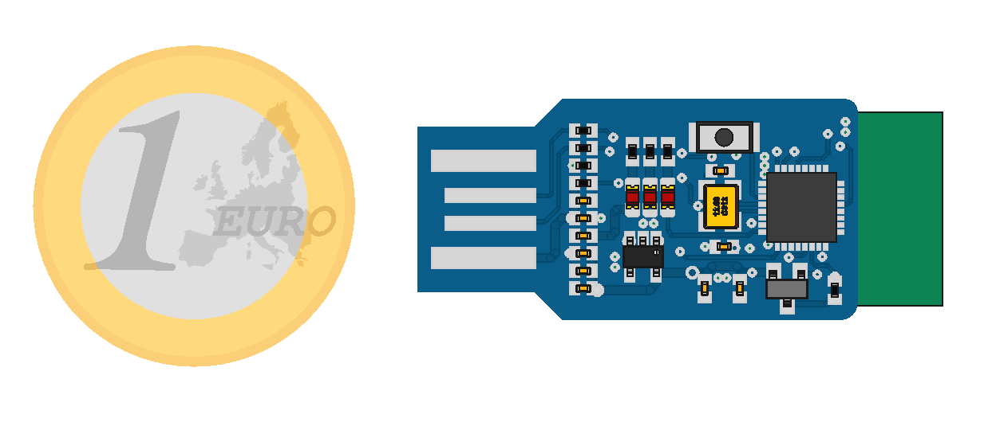

BT-USB
===================================================================

This board is a bidirectional Bluetooth to USB bridge. It uses a BC04 bluetooth module and a LPC11u24 microcontroller programmed with Mbed. 

It is used as a bluetooth dongle to which a master can connect automatically on boot, and thus communicate with a computer without needing pairing.

